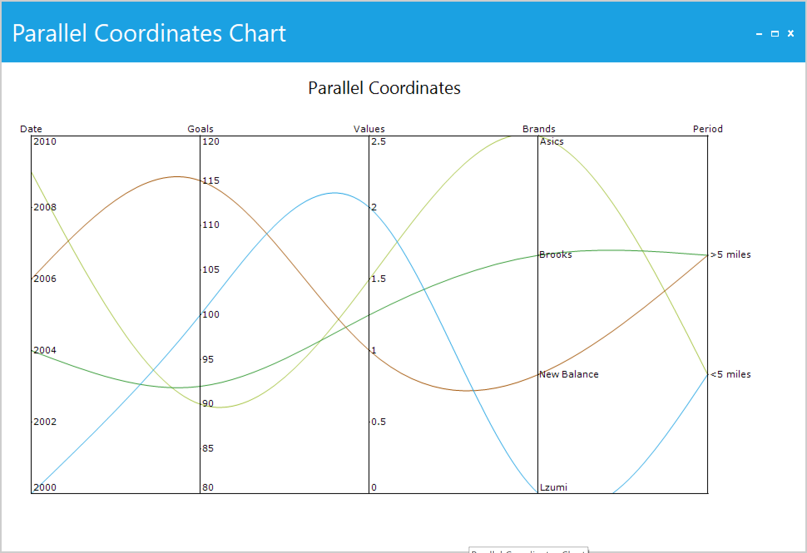

# How-to-create-parallel-coordinate-plot-in-WinForms-Charts

This article explains how to create a parallel coordinates plot chart in winforms. Parallel coordinates are a common way of visualizing and analyzing high-dimensional datasets.

The [chart control](https://help.syncfusion.com/cr/windowsforms/Syncfusion.Windows.Forms.Chart.ChartControl.html) supports parallel coordinates charts by using multiple spline series and axes.

The following steps and code illustrate how to create parallel coordinate plot chart using Syncfusion [chart](https://help.syncfusion.com/cr/windowsforms/Syncfusion.Windows.Forms.Chart.ChartControl.html).

**Step 1:** Create a custom parallel coordinate chart by extending the [ChartControl](https://help.syncfusion.com/cr/windowsforms/Syncfusion.Windows.Forms.Chart.ChartControl.html) and generate the multiple spline series and axes for the parallel coordinate chart as per in the below code.

```
public class ParallelCoordinateChart : ChartControl
{
        private BindingList<ChartModel> source;

        public BindingList<ChartModel> DataSource
        {
            get
            {
                return source;
            }
            set
            {
                source = value;
                GenerateSeries();
            }
        }

        private ChartSeriesType type = ChartSeriesType.Line;

        public ChartSeriesType SeriesType
        {
            get
            {
                return type;
            }
            set
            {
                type = value;
                AddAxis();
                GenerateSeries();
            }
        }

        private List<CustomAxisModel> customAxisList;

        public List<CustomAxisModel> CustomAxisCollection
        {
            get
            {
                return customAxisList;
            }
            set
            {
                customAxisList = value;
                AddAxis();
            }
        }

        private void AddAxis()
        {
            if (CustomAxisCollection != null)
            {
                foreach (var item in CustomAxisCollection)
                {
                    if (!Axes.Contains(item.CustomAxis))
                        Axes.Add(item.CustomAxis);
                }
            }
        }

        public ParallelCoordinateChart() : base()
        {
            this.PrimaryXAxis.ValueType = ChartValueType.Category;
            this.PrimaryXAxis.Range = new MinMaxInfo(0, 4, 1);
            this.PrimaryXAxis.IsVisible = true;
            this.PrimaryXAxis.OpposedPosition = true;
            this.PrimaryXAxis.DrawGrid = false;
            this.PrimaryYAxis.ValueType = ChartValueType.Double;
            this.PrimaryYAxis.Range = new MinMaxInfo(0, 100, 10);
            this.PrimaryYAxis.IsVisible = false;
            this.PrimaryYAxis.DrawGrid = false;
            this.PrimaryYAxis.Crossing = 0;
            this.PrimaryYAxis.LineType.ForeColor = Color.Transparent;
            AddAxis();
            GenerateSeries();
        }

        private void GenerateSeries()
        {
            if (DataSource != null && CustomAxisCollection != null && CustomAxisCollection.Count >=  
                                                                                        DataSource.Count)
            {
                Series.Clear();

                foreach (var item in DataSource)
                {
                    BindingList<SeriesModel> itemsSoruce = new BindingList<SeriesModel>();

                    foreach (var value in item.Variable)
                    {
                        var index = item.Variable.IndexOf(value);
                        var range = CustomAxisCollection[index].PlotRange;
                        var diff = range.Max - range.Min;
                        double result;
                        double yvalue = 0;

                        if (double.TryParse(value.ToString(), out result))
                            yvalue = ((result - range.Min) / (double)diff) * 100;
                        else
                        {
                            result = CustomAxisCollection[index].CustomAxisLabels.IndexOf(value.ToString());
                            yvalue = ((result - range.Min) / (double)diff) * 100;
                        }

                        itemsSoruce.Add(new SeriesModel(CustomAxisCollection[index].AxisName, yvalue));
                    }

                    CategoryAxisDataBindModel dataSeriesModel = new 
                                                                   CategoryAxisDataBindModel(itemsSoruce);
                    dataSeriesModel.CategoryName = "XValues";
                    dataSeriesModel.YNames = new string[] { "YValues" };
                    ChartSeries LineSeries = new ChartSeries();
                    LineSeries.Type = SeriesType;
                    LineSeries.SortPoints = false;
                    LineSeries.CategoryModel = dataSeriesModel;
                    this.Series.Add(LineSeries);
                }
            }
        }
}

```


**Step 2:** Now generate the parallel coordinates chart using the custom ParallelCoordinateChart based on the required DataSource data as per in the below code.

```
…
this.chartControl = new ParallelCoordinateChart();
this.SuspendLayout();
this.chartControl.Legend.Visible = false;

var axisCollection = new List<CustomAxisModel>()
{
       new CustomAxisModel(new MinMaxInfo(2000, 2010, 2), 0, null, "Date"),
       new CustomAxisModel(new MinMaxInfo(80, 120, 5), 1, null, "Goals"),
       new CustomAxisModel(new MinMaxInfo(0, 2.5, 0.5), 2, null, "Values"),
       new CustomAxisModel(null, 3, new List<string>() { "Lzumi", "New Balance", "Brooks", "Asics" }, 
                                        "Brands"),
       new CustomAxisModel(null, 4, new List<string>() { " ", "<5 miles", ">5 miles", " " }, "Period")
};

this.chartControl.CustomAxisCollection = axisCollection;
this.chartControl.SeriesType = ChartSeriesType.Spline;

BindingList<ChartModel> dataSource = new BindingList<ChartModel>()
{
       new ChartModel(new List<object>() { 2000, 100, 2.0, "Lzumi", "<5 miles" }),
       new ChartModel(new List<object>() { 2006, 115, 1.0, "New Balance", ">5 miles" }),
       new ChartModel(new List<object>() { 2004, 92, 1.25, "Brooks", ">5 miles" }),
       new ChartModel(new List<object>() { 2009, 90, 1.5, "Asics", "<5 miles" })
};

this.chartControl.DataSource = dataSource;
…
this.Controls.Add(chartControl);
```

**Step 3:** Create the CustomAxisModel to generate axis based on the required data as per in the below code.

```
public class CustomAxisModel
{
        private MinMaxInfo plotRanges;
        public MinMaxInfo PlotRange
        {
            get
            {
                return plotRanges;
            }
            set
            {
                plotRanges = value;
            }
        }

        private int indexs = Int32.MaxValue;

        public int Index
        {
            get
            {
                return indexs;
            }
            set
            {
                indexs = value;
            }
        }

        private List<string> customAxisLabel;

        public List<string> CustomAxisLabels
        {
            get
            {
                return customAxisLabel;
            }
            set
            {
                if (value != null)
                {
                    customAxisLabel = value;
                    GenerateCustomAxis();
                }
            }
        }

        public ChartAxis CustomAxis { get; set; }
        public string AxisName { get; set; }
        public CustomAxisModel(MinMaxInfo range, int AxisIndex, List<string> axisLabels, string name)
        {
            PlotRange = range;
            Index = AxisIndex;
            CustomAxisLabels = axisLabels;
            AxisName = name;
            GenerateCustomAxis();
        }

        private void GenerateCustomAxis()
        {
            if (CustomAxis == null)
                CustomAxis = new ChartAxis()
                {
                    AxisLabelPlacement = ChartPlacement.Inside,
                    EdgeLabelsDrawingMode = ChartAxisEdgeLabelsDrawingMode.Shift,
                    DrawGrid = false,
                    Orientation = ChartOrientation.Vertical
                };

            if (Index != Int32.MaxValue)
                CustomAxis.Crossing = Index;

            if (CustomAxisLabels != null && CustomAxisLabels.Count > 0)
            {
                CustomAxis.FormatLabel -= CustomAxis_FormatLabel;
                CustomAxis.FormatLabel += CustomAxis_FormatLabel;

                PlotRange = new MinMaxInfo(0, CustomAxisLabels.Count - 1, 1);
            }

            if (PlotRange != null)
                CustomAxis.Range = PlotRange;
        }

        private void CustomAxis_FormatLabel(object sender, ChartFormatAxisLabelEventArgs e)
        {
            if (CustomAxisLabels != null && CustomAxisLabels.Count > e.Value)
                e.Label = CustomAxisLabels[System.Convert.ToInt32(e.Value)];

            e.Handled = true;
        }
}
```

## Output



## See Also

[How to create a real-time chart](https://www.syncfusion.com/kb/9344/how-to-create-a-real-time-chart)

[How to create Chart in VB .NET Windows Forms](https://www.syncfusion.com/kb/10806/how-to-create-chart-in-vb-net-windows-forms)

[How to bind the data source via chart wizard](https://www.syncfusion.com/kb/7680/how-to-bind-the-data-source-via-chart-wizard)